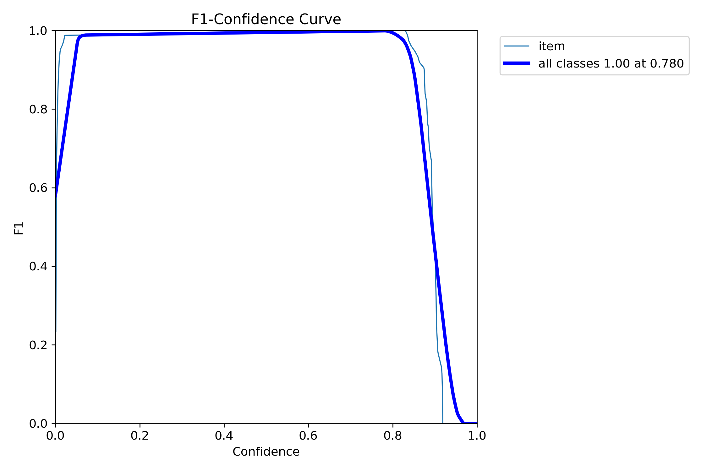
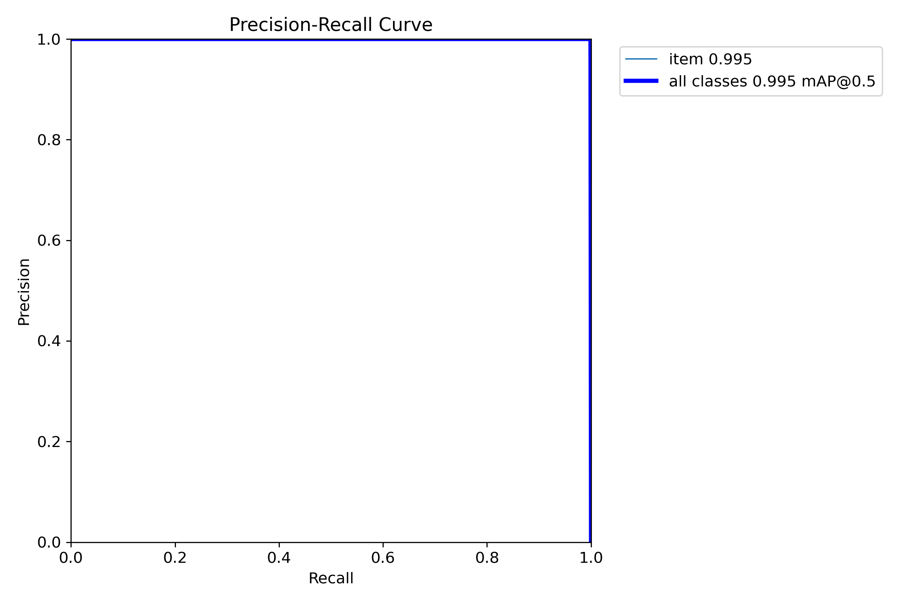
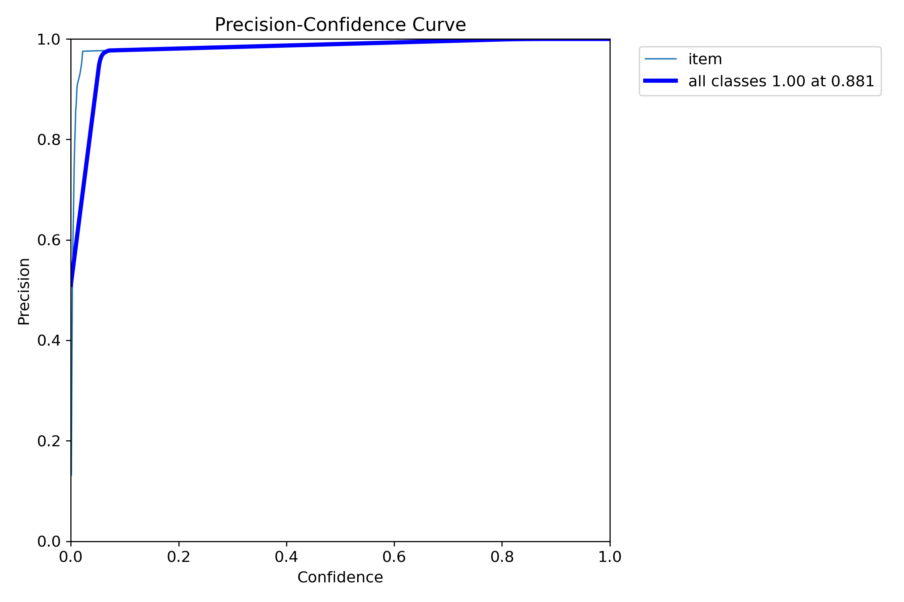
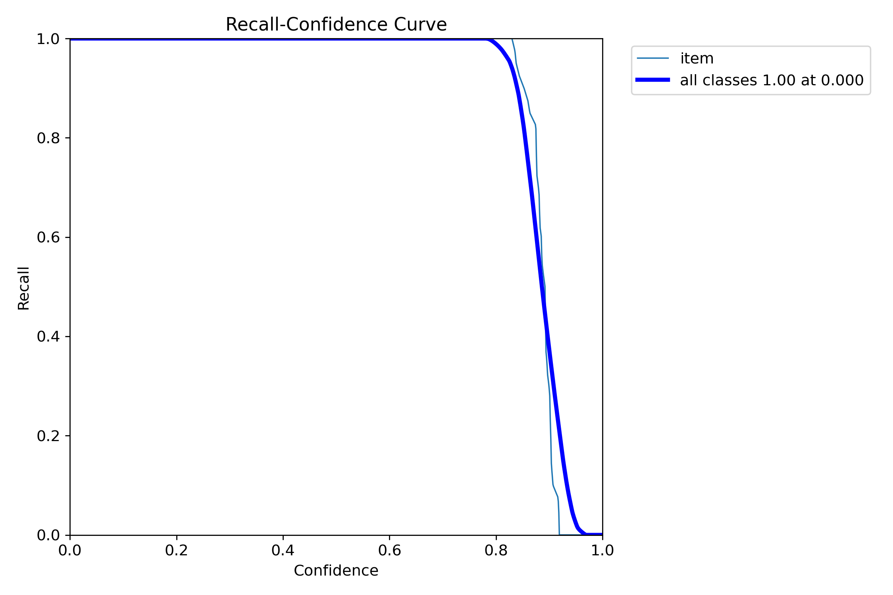
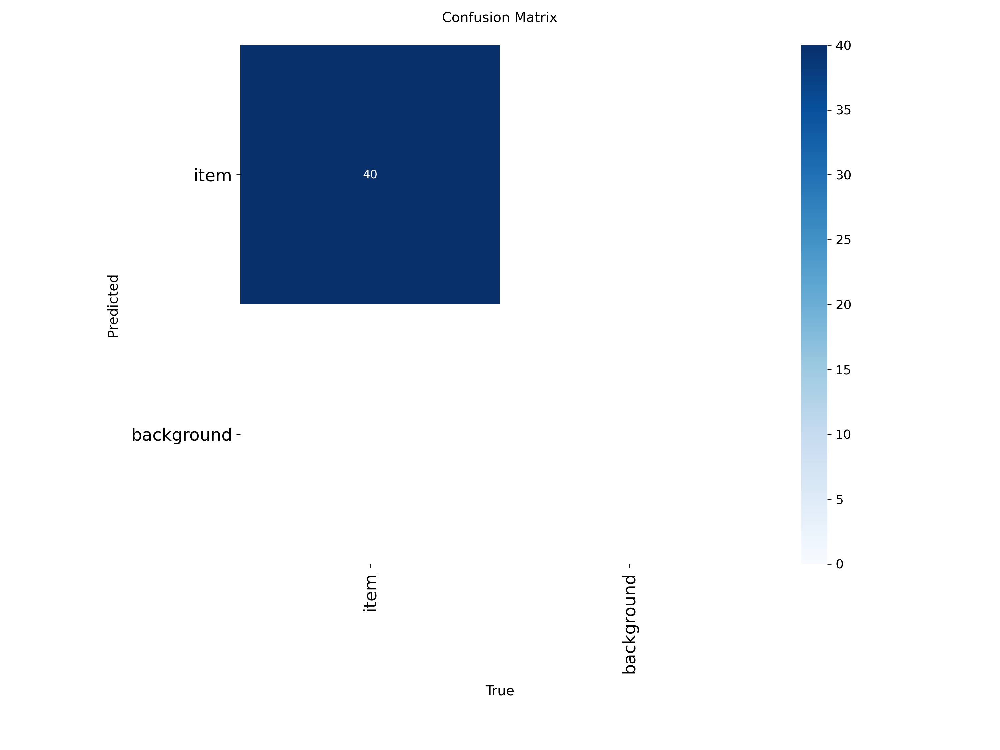
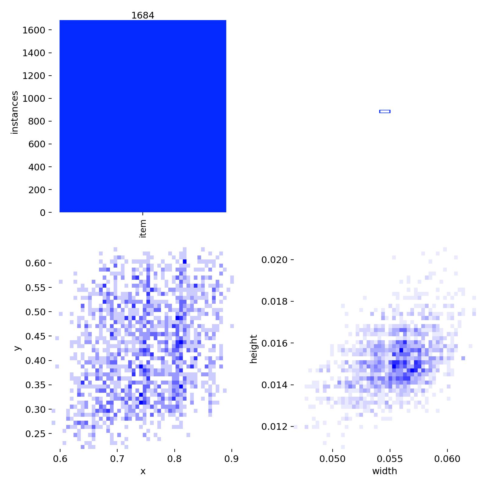
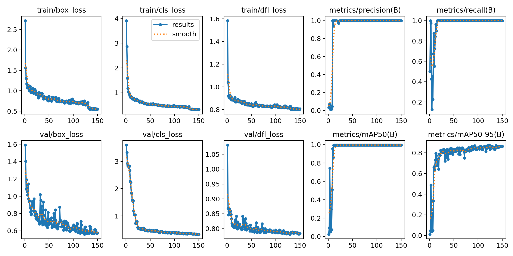
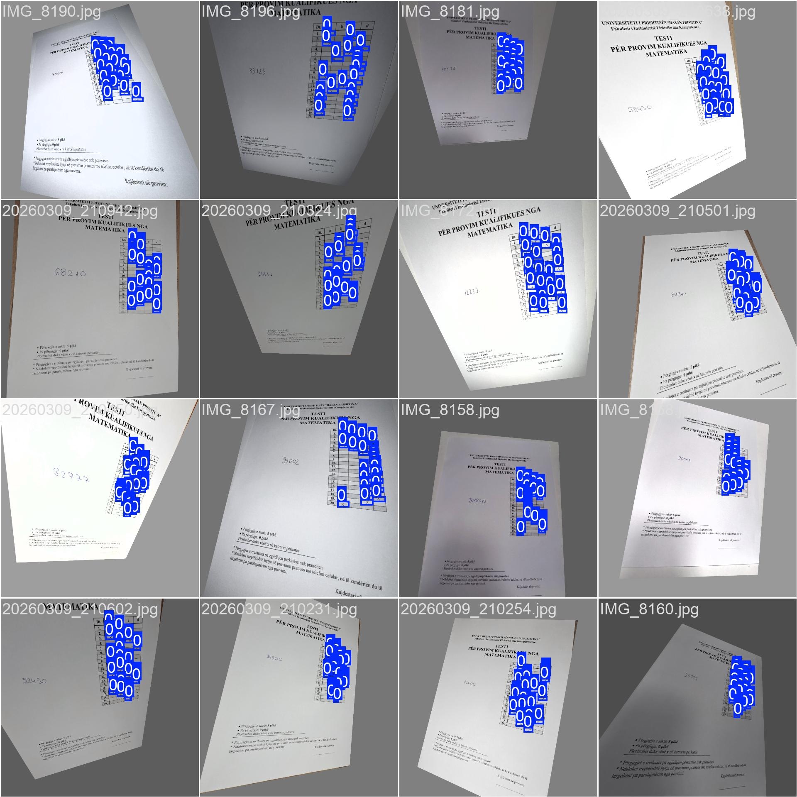

# University of Prishtina

## Faculty of Electrical and Computer Engineering

**Study Program:** Computer and Software Engineering – Master  
**Course:** Machine Learning  
**Group:** 14  

# Project Topic

## Training and Application of the YOLO Model for Automatic Detection and Evaluation of Entrance Exams at FIEK

</div>

---

# Disclaimer

This project material is prepared strictly for internal academic project purposes.

Publishing, reposting, redistributing, or using any part of this material online or in any other external context is not permitted without prior written approval from the project team and course supervisor.

---

# Project Overview

This project focuses on the design and implementation of an **automated system for detecting and evaluating entrance exam tests** using **Artificial Intelligence and Computer Vision techniques**.

The system is based on the **YOLO (You Only Look Once)** deep learning model, which is widely used for **real-time object detection**.

The main objective of this project is to create a system capable of automatically analyzing **exam sheets** and extracting relevant information from them, including:

- Candidate identification code
- The position of each answer field
- Selected answers marked by the candidate
- Correct answers
- Final score calculation

By automating this process, the system can significantly **reduce the time required to evaluate entrance exams**, while also **increasing accuracy and consistency**.

---

# Motivation of the Project

Entrance exams often involve a large number of candidates. Evaluating these tests manually requires significant time and effort from academic staff.

Manual grading may also introduce potential issues such as:

- Human errors during correction
- Inconsistent evaluation
- Fatigue during large-scale exam processing
- Slow result generation

The goal of this project is to develop an **AI-based automated grading system** that can assist institutions by providing:

- Faster evaluation
- Consistent grading
- Reduced manual workload
- Reliable automated results

---

The project is organized into tree main phases:

- **Phase 1 – Current System Implementation**
- **Phase 2 – YOLO Model Training and Improvement**
- **Phase 3 – Improvement in model (Future Improvements)**
  
---

# Phase 1

# Dataset Creation

A **custom dataset** was created specifically for training the YOLO model used in this project.

The dataset contains approximately **100 exam sheet samples**, representing different ways candidates may fill out their tests, and includes around 2,000 annotated questions.

To simulate realistic exam conditions, these test sheets were **distributed among randomly selected individuals**, who were asked to complete them as if they were taking an actual entrance exam.

This approach was chosen in order to ensure that the dataset contains **natural variations in human behavior and writing styles**, which is essential for training a robust machine learning model.

---

# Data Diversity and Realistic Scenarios

The dataset was intentionally designed to include a wide range of realistic scenarios.

Some of the cases included in the dataset are:

- Fully completed exam sheets
- Partially completed exam sheets
- Questions intentionally **left unanswered**
- Cases where **multiple answers were marked**
- Answers filled **very lightly**
- Answers filled **very strongly**
- Incomplete markings
- Slightly misaligned markings
- Deviations from the expected filling pattern
- Crossed-out answers
- Cases where candidates **changed their answers**

Additionally, the dataset includes examples where:

- The answer circle is only partially filled
- The candidate marked outside the expected area
- The candidate left blank responses
- The candidate selected incorrect answers intentionally

These variations were intentionally included to make the dataset **more robust and closer to real-world exam situations**.

---

# Image Acquisition

All test sheets were converted into **image format**, since YOLO models operate on visual data.

Images were collected using:

- Document scanners
- Smartphone cameras
- Standard digital cameras

Different image capture conditions were intentionally used, including:

- Slight rotation of the paper
- Minor perspective distortions
- Different lighting conditions
- Shadows created during scanning or photographing

This diversity helps the model learn to perform well under **real-world conditions**, where input images are rarely perfectly aligned.

---

# Data Validation and Quality Assurance

Before being included in the dataset, each image underwent a **manual verification process**.

The following aspects were checked carefully:

- Image clarity and sharpness
- Visibility of candidate codes
- Visibility of answer areas
- Proper positioning of the exam sheet
- Absence of extreme distortions
- Proper resolution and image quality

After the first verification stage, a **second manual review process** was conducted to ensure that:

- No corrupted images were included
- Annotation errors were avoided
- Dataset structure remained consistent

This two-step verification process ensures that the dataset maintains **high quality and reliability**.

High-quality datasets are extremely important for machine learning models because poor data quality can significantly reduce model performance.

---

# Data Annotation Process

After collecting and verifying the images, the next step was **data annotation**.

Annotation involves labeling specific parts of each image so that the model can learn to detect them.

The following objects were annotated:

- Candidate code area
- Answer bubble locations
- Question areas
- Marked answers

Each annotation was saved using the **YOLO annotation format**, which includes:

- Object class
- Bounding box coordinates
- Image reference

These annotations are essential because they allow the YOLO model to **learn how to detect objects within exam sheet images**.

---

# Dataset Structure

The dataset used in this project follows a structured format commonly used in YOLO training pipelines.

The dataset contains:

- Training images
- Validation images
- Corresponding annotation files

Example structure:

---

# Model Training Pipeline

The YOLO model training process follows several steps:

## 1 Dataset Preparation
The collected dataset is cleaned, verified, and structured.

## 2 Data Splitting
The dataset is divided into:

- Training set
- Validation set

This helps the model learn while also allowing performance evaluation.

## 3 Model Configuration
The YOLO configuration files are adjusted to match:

- Number of classes
- Dataset structure
- Training parameters

## 4 Model Training
The model is trained on the dataset using deep learning techniques.

During training, the model learns to:

- Detect answer bubbles
- Identify candidate codes
- Recognize marked answers
- Distinguish filled vs empty responses

## 5 Model Evaluation
After training, the model is evaluated using validation data.

Key performance metrics may include:

- Precision
- Recall
- mAP (Mean Average Precision)

---

# Automated Exam Evaluation

Once the model is trained, the system will be able to process new exam sheet images automatically.

The process includes:

1. Uploading the exam sheet image
2. Running YOLO object detection
3. Detecting candidate code and answers
4. Comparing detected answers with the correct answer key
5. Calculating the final score

---

# Expected Output

The system will generate the final result in the following format:

Example output:

210453 - 17


This allows fast evaluation of large numbers of exam sheets.

---

# Advantages of the System

The proposed system provides several advantages:

- Faster evaluation of entrance exams
- Reduced manual correction workload
- Increased grading accuracy
- Consistent evaluation results
- Scalable solution for large exam datasets
- Reduced human error
- Automated processing of exam sheets

---

# Technologies Used

This project uses the following technologies:

- Python
- YOLO (You Only Look Once)
- Computer Vision
- Image Processing
- Deep Learning
- Machine Learning

---

# Future Improvements

Future improvements may include:

- Increasing the dataset size
- Improving model accuracy
- Integrating the system with a web platform
- Supporting different exam formats
- Real-time exam sheet analysis
- Integration with university exam systems

---

# Phase 2

This section provides an in-depth academic discussion regarding dataset robustness, model generalization, and system scalability.

The dataset used in this project has been carefully engineered to simulate real-world exam conditions. One of the most important aspects of machine learning systems is the ability to generalize beyond the training data. In this context, generalization refers to the model’s capability to perform accurately on unseen data.

In practical scenarios, exam sheets are rarely captured under ideal conditions. Therefore, introducing noise, distortions, and irregularities into the dataset significantly improves the robustness of the trained model. These include variations in illumination, slight rotations, perspective transformations, and differences in marking intensity.

Furthermore, the YOLO model architecture allows for real-time object detection, making it suitable for applications where performance and speed are critical. The bounding-box detection approach enables the model to localize relevant features efficiently.

From a system architecture perspective, separating the machine learning logic into a Python API ensures modularity. The .NET backend acts as a communication layer, while Angular provides a user-friendly interface. This separation of concerns ensures maintainability and scalability.

Another important aspect is the evaluation of the system. Metrics such as precision, recall, and mean average precision (mAP) are used to assess the model’s performance. High precision ensures that detected answers are correct, while high recall ensures that most relevant answers are detected.

---

## Current Architecture

The current project structure is divided into the following main parts:

- **Dataset/** – contains exam sheet images and related project material
- **ML ASP.NET service / ExamNumberReader/** – main backend service in ASP.NET Core
- **frontend/** – Angular frontend application
- **yolo-api/** – Python service responsible for detection-related logic

# Exam Grading System

Automatic test evaluation system using YOLO for answer detection and .NET for student ID recognition.

## Architecture

```
┌─────────────────────┐     ┌─────────────────────┐     ┌─────────────────────┐
│   Angular Frontend  │────▶│    .NET API         │────▶│   YOLO API          │
│   (Port 4200)       │     │    (Port 5000)      │     │   (Port 8001)       │
└─────────────────────┘     └─────────────────────┘     └─────────────────────┘
         │                           │                           │
         │                           │                           │
         ▼                           ▼                           ▼
    Upload CSV            Extract Student ID           Detect Marked
    Answer Key            (Tesseract + ONNX)           Answers (YOLO)
```

## Components

### 1. YOLO API (`yolo-api/`)
FastAPI service for detecting marked answers on exam sheets.

**Endpoints:**
- `GET /health` - Health check
- `POST /detect` - Detect answers from single image
- `POST /detect/batch` - Detect answers from multiple images

### 2. .NET API (`ML ASP.net service/`)
ASP.NET Core API for exam processing and grading.

**Endpoints:**
- `POST /api/grading/answer-key` - Upload CSV answer key
- `GET /api/grading/answer-key/current` - Get current answer key
- `POST /api/grading/grade` - Grade single exam
- `POST /api/grading/grade/batch` - Grade multiple exams
- `POST /api/grading/export/csv` - Export results to CSV
- `POST /api/grading/export/excel` - Export results to Excel
- `POST /api/image/extract-number` - Extract 5-digit student ID

### 3. Angular Frontend (`frontend/`)
Modern web interface for exam grading.

**Features:**
- Step-by-step wizard interface
- Drag & drop file upload
- Real-time grading results
- Results table with color-coded answers
- CSV/Excel export

## Quick Start

### Prerequisites
- Python 3.10+
- .NET 9.0 SDK
- Node.js 18+
- YOLO trained model (`best.pt`)
- Tesseract OCR data files

### 1. Start YOLO API

```bash
cd yolo-api
python -m venv .venv
.venv\Scripts\activate  # Windows
# source .venv/bin/activate  # Linux/Mac
pip install -r requirements.txt
python run.py
```

The API will be available at `http://localhost:8001`

### 2. Start .NET API

```bash
cd "ML ASP.net service\ExamNumberReader"
dotnet run
```

The API will be available at `http://localhost:5000`

### 3. Start Angular Frontend

```bash
cd frontend
npm install
npm start
```

Open `http://localhost:4200` in your browser

## CSV Answer Key Format

Create a CSV file with question numbers and correct answers:

```csv
1,A
2,B
3,C
4,D
5,A
...
20,B
```

Or simply list answers in order (one per line):

```
A
B
C
D
A
...
```

## Configuration

### YOLO API
Environment variables:
- `YOLO_MODEL_PATH` - Path to trained YOLO model (default: auto-detected)
- `API_HOST` - Host to bind (default: 0.0.0.0)
- `API_PORT` - Port to bind (default: 8001)

### .NET API
`appsettings.json`:
```json
{
  "YoloApi": {
    "BaseUrl": "http://localhost:8001"
  }
}
```

### Angular Frontend
`environment.ts`:
```typescript
export const environment = {
  apiUrl: 'http://localhost:5000/api'
};
```

## Model Training

The YOLO model was trained to detect marked checkboxes. Training scripts are in `student-answer-yolo/student-answer-yolo/scripts/`:

- `train.py` - Train the YOLO model
- `predict.py` - Test predictions
- `grade_students.py` - Complete grading pipeline

### Training run: `student_answer_v2`

Ultralytics YOLO writes validation plots and batch visualizations under `student-answer-yolo/student-answer-yolo/runs/detect/runs/student_answer_v2/`. The figures below summarize how the detector behaves on the validation set after training (curves are typically shown **per class** and/or **aggregated** depending on YOLO version and settings).

These assets live in [`student_answer_v2`](https://github.com/ErandKurtaliqi/ML_2025-26_GR_14/tree/main/student-answer-yolo/student-answer-yolo/runs/detect/runs/student_answer_v2). Images below use **paths relative to the repo root** so GitHub can render them the same way as other files in the tree.

**Why the preview can look “broken”**

1. **Cursor / VS Code “Markdown Preview”** loads `` from **your disk**. If the `.png` / `.jpg` files are not in that folder locally (only on GitHub), the preview shows an empty or broken icon. **Fix:** run `git pull`, or copy the images into `student-answer-yolo/student-answer-yolo/runs/detect/runs/student_answer_v2/`, or open the README on **github.com** after you push—there the images match the repository files.
2. **Do not use** `https://github.com/.../blob/main/...png` inside ``. That URL is an **HTML page**, not the image bytes. For hotlinking outside GitHub you would use `https://raw.githubusercontent.com/<user>/<repo>/<branch>/...` instead; GitHub’s own README still works best with **relative** paths.
3. **Private repository:** anonymous `raw.githubusercontent.com` links often **404** in a preview; relative paths in the README are resolved by GitHub with your session and usually render correctly on the website.

#### Box F1 curve (`BoxF1_curve.png`)

The **F1 score** combines precision and recall into one number. This plot shows **F1 versus confidence threshold**, so you can see at which operating point the detector best balances false positives and false negatives when turning raw boxes into “marked vs empty” decisions.

  
*[View file on GitHub](https://github.com/ErandKurtaliqi/ML_2025-26_GR_14/blob/main/student-answer-yolo/student-answer-yolo/runs/detect/runs/student_answer_v2/BoxF1_curve.png)*

#### Precision–Recall curve (`BoxPR_curve.png`)

The **PR curve** plots precision against recall across thresholds. A curve that stays **high and toward the upper-right** indicates strong ranking of true boxes; the area under this curve is related to **Average Precision (AP)** for the box-detection task.

  
*[View file on GitHub](https://github.com/ErandKurtaliqi/ML_2025-26_GR_14/blob/main/student-answer-yolo/student-answer-yolo/runs/detect/runs/student_answer_v2/BoxPR_curve.png)*

#### Precision vs confidence (`BoxP_curve.png`)

This graph shows how **precision changes as the confidence cutoff is raised**. Higher thresholds usually increase precision (fewer weak detections kept) but may drop recall if correct boxes are filtered out.

  
*[View file on GitHub](https://github.com/ErandKurtaliqi/ML_2025-26_GR_14/blob/main/student-answer-yolo/student-answer-yolo/runs/detect/runs/student_answer_v2/BoxP_curve.png)*

#### Recall vs confidence (`BoxR_curve.png`)

This graph shows how **recall changes with the confidence threshold**. Lower thresholds keep more detections, which often helps recall but can introduce more false positives—use it together with the precision plot to choose a threshold.

  
*[View file on GitHub](https://github.com/ErandKurtaliqi/ML_2025-26_GR_14/blob/main/student-answer-yolo/student-answer-yolo/runs/detect/runs/student_answer_v2/BoxR_curve.png)*

#### Confusion matrix (`confusion_matrix.png`)

The **confusion matrix** counts predictions versus ground-truth classes (e.g., `empty_box` vs `marked_box`). Off-diagonal cells show which classes are confused with each other and guide targeted fixes (annotation quality, class balance, or augmentation).

  
*[View file on GitHub](https://github.com/ErandKurtaliqi/ML_2025-26_GR_14/blob/main/student-answer-yolo/student-answer-yolo/runs/detect/runs/student_answer_v2/confusion_matrix.png)*

#### Normalized confusion matrix (`confusion_matrix_normalized.png`)

The same information as the confusion matrix, but **normalized per true class** (rows or columns depending on the tool), so you can compare error rates **between classes** even when class counts differ.

  
*[View file on GitHub](https://github.com/ErandKurtaliqi/ML_2025-26_GR_14/blob/main/student-answer-yolo/student-answer-yolo/runs/detect/runs/student_answer_v2/confusion_matrix_normalized.png)*

#### Label distribution (`labels.jpg`)

Ultralytics generates a **label overview** (class frequency, box sizes, and positions in image coordinates). It helps verify **annotation balance** and whether boxes are concentrated in certain regions of the sheet, which affects learning and evaluation.

  
*[View file on GitHub](https://github.com/ErandKurtaliqi/ML_2025-26_GR_14/blob/main/student-answer-yolo/student-answer-yolo/runs/detect/runs/student_answer_v2/labels.jpg)*

#### Training results summary (`results.png`)

`results.png` is a **multi-panel summary** of the run: training and validation losses, and core detection metrics (such as precision, recall, and mAP) **over epochs**. It is the fastest way to spot overfitting (train improves while validation stalls) or unstable training.

  
*[View file on GitHub](https://github.com/ErandKurtaliqi/ML_2025-26_GR_14/blob/main/student-answer-yolo/student-answer-yolo/runs/detect/runs/student_answer_v2/results.png)*

#### Training batch sample (`train_batch780.jpg`)

A **mosaic of training batches** (often heavily augmented) at a given step—here batch **780**. It confirms that augmentations look reasonable (geometry, color, mosaic layout) and that labels still align with transformed images.

  
*[View file on GitHub](https://github.com/ErandKurtaliqi/ML_2025-26_GR_14/blob/main/student-answer-yolo/student-answer-yolo/runs/detect/runs/student_answer_v2/train_batch780.jpg)*

## Project Structure

```
ML-Web/
├── frontend/                    # Angular web application
│   ├── src/
│   │   ├── app/
│   │   │   ├── components/
│   │   │   ├── services/
│   │   │   └── models/
│   │   └── styles.scss
│   └── package.json
├── ML ASP.net service/          # .NET Core API
│   └── ExamNumberReader/
│       ├── Controllers/
│       ├── Services/
│       ├── Models/
│       └── Program.cs
├── yolo-api/                    # FastAPI YOLO service
│   ├── app/
│   │   ├── main.py
│   │   ├── detection_service.py
│   │   └── models.py
│   └── requirements.txt
└── student-answer-yolo/         # YOLO training & scripts
    └── student-answer-yolo/
        ├── scripts/
        ├── dataset/
        ├── runs/
        └── data.yaml
```

## API Documentation

### Swagger UI
- .NET API: http://localhost:5000
- YOLO API: http://localhost:8001/docs

## Troubleshooting

### YOLO model not loading
Ensure the model file exists at the configured path. Check logs for the actual path being used.

### OCR not working
Make sure Tesseract data files are in the `tessdata` folder and the MNIST ONNX model is in the `models` folder.

### CORS errors
Both APIs are configured to allow all origins. If you still see CORS errors, check the browser console for more details for debug.

## License

This project is for educational purposes.
# ML_web

---

## Backend – ASP.NET Core Service

The ASP.NET Core backend is responsible for the main business logic of the system.

Its responsibilities include:

- Receiving exam sheet images
- Managing grading logic
- Calling OCR and detection services
- Comparing detected answers with the answer key
- Exporting results
- Exposing API endpoints for the frontend

The backend includes:

- **Controllers** for API endpoints
- **Models** for data structures
- **Services** for grading, OCR, export, and answer key processing

---

## Python Detection API

A dedicated Python API is included in the system architecture to support machine learning and detection logic.

This module contains:

- Configuration files
- Detection service logic
- Model-related code
- Python entry points for execution

The Python service is designed to be modular, so it can later be extended with a trained YOLO model in Phase 2.

---

## Frontend – Angular Application

The frontend provides the user interface of the system.

Its main responsibilities are:

- Uploading exam sheet images
- Sending requests to the backend
- Displaying extracted results
- Presenting grading information in a user-friendly format

This layer ensures easier interaction with the automated grading system.

---

## Current Workflow

The current system workflow is as follows:

1. The user uploads an exam sheet image
2. The frontend sends the image to the backend
3. The backend processes the request
4. OCR / detection logic is executed
5. The candidate code is extracted
6. Answers are detected and interpreted
7. The answers are compared with the correct answer key
8. The final score is calculated
9. The result is returned to the frontend

---

## Overview of Phase 2

Phase 2 represents the **core machine learning stage** of the project, where the system transitions from basic architectural design and preprocessing logic into a fully functional **intelligent detection pipeline**.

The primary focus of this phase is the **training, validation, and optimization of a YOLO-based object detection model**, designed specifically for analyzing exam sheets.

Unlike Phase 1, which focuses on system structure and data flow, this phase emphasizes:

- Model accuracy  
- Detection reliability  
- Real-world robustness  
- Scalability for production environments  

The trained model aims to detect and interpret key elements of exam sheets, including:

- Candidate code area  
- Answer bubbles  
- Marked answers  
- Question-related regions  

---

## Machine Learning Approach

The project leverages the power of **YOLO (You Only Look Once)**, a state-of-the-art real-time object detection algorithm.

YOLO is chosen because of its:

- High detection speed  
- Strong accuracy for object localization  
- Ability to detect multiple classes in a single pass  
- Suitability for real-time systems  

The model processes exam sheet images and produces:

- Bounding boxes  
- Class labels  
- Confidence scores  

These outputs are then used for further processing, including **answer recognition and grading logic**.

---

## Main Activities of Phase 2

The second phase consists of multiple structured steps:

### 1. Dataset Preparation
- Collecting real exam sheets
- Ensuring diversity in format and marking styles
- Organizing images into structured datasets

### 2. Image Verification
- Checking image quality
- Removing corrupted or unusable samples
- Standardizing image formats and resolutions

### 3. Data Annotation
- Labeling all relevant regions using bounding boxes
- Ensuring annotation consistency
- Exporting labels in YOLO format

### 4. Dataset Splitting
- Training set (≈70–80%)
- Validation set (≈10–20%)
- Test set (≈10%)

### 5. YOLO Configuration
- Defining class labels
- Configuring model architecture
- Setting training parameters (epochs, batch size, learning rate)

### 6. Model Training
- Training the YOLO model on annotated data
- Monitoring loss and accuracy metrics
- Adjusting hyperparameters when necessary

### 7. Model Validation
- Evaluating model on validation dataset
- Detecting overfitting or underfitting
- Fine-tuning model performance

### 8. Performance Evaluation
- Measuring:
  - Precision  
  - Recall  
  - mAP (mean Average Precision)  
- Analyzing detection errors

### 9. System Integration
- Integrating the trained model into backend (Python / API)
- Connecting results with ASP.NET Core logic
- Preparing outputs for Angular frontend

---

## Expected Goal of Phase 2

At the completion of this phase, the system should include a **fully trained and optimized YOLO model** capable of:

- Accurately detecting all relevant exam elements  
- Handling real-world variations in marking  
- Supporting automated grading workflows  

This will significantly improve:

- Accuracy  
- Reliability  
- Efficiency  

> A more detailed technical breakdown will be included in future README updates.

---

## Dataset

A custom dataset was created specifically for this project to simulate real exam scenarios.

### Dataset Characteristics

- ~100 exam sheet samples  
- Multiple marking styles and conditions  

### Included Scenarios

- Fully completed sheets  
- Partially completed sheets  
- Blank answers  
- Multiple marked answers  
- Light and strong markings  
- Crossed-out answers  
- Changed responses  
- Slight misalignment of markings  

### Image Sources

Images were collected using:

- Document scanners  
- Smartphone cameras  
- Standard digital cameras  

This diversity ensures the model learns to handle **real-world noise and variability**.

---

## Data Annotation

Annotation is a critical part of this phase.

### Annotated Elements

- Candidate code area  
- Answer bubble locations  
- Marked answers  
- Question regions  

### Annotation Format

All annotations follow the **YOLO format**, where each object is defined by:
<class_id> <x_center> <y_center> <width> <height>


### Challenges in Annotation

- Ensuring consistency across samples  
- Handling ambiguous markings  
- Labeling overlapping regions  

---

## Technologies Used

This project integrates multiple technologies across different layers:

### Backend
- ASP.NET Core (API & business logic)

### Frontend
- Angular (UI and visualization)

### AI / Processing
- Python  
- YOLO  
- OCR (for candidate code extraction)  

### Core Domains
- Machine Learning  
- Computer Vision  
- Image Processing

---

  - të **normalizuara (0–1)**
  - në raport me dimensionet e imazhit

---

# Training Process (YOLO)

## Image Description

This image represents a sample from the dataset used to train the **YOLO model** for detecting student answers in multiple-choice tests.

The test originates from the **Faculty of Electrical and Computer Engineering** and is used as an entrance exam at the **Bachelor level**.

The image contains:

- A **grid of answer options (A, B, C, D)** for each question  
- Approximately **20 multiple-choice questions**  
- Some boxes are **marked by the student (with X)**  
---

## Labeling Process (LabelImg)

The dataset was created using the tool:

**LabelImg**

Each answer option (box) is manually annotated using **bounding boxes**.

### Classes Used

- **`marked_box`** → box selected by the student  
- **`empty_box`** → unselected (empty) box  

### Methodology

- For every answer option (A, B, C, D) in each question:
  - a **bounding box** is created
- Each bounding box is classified as:
  - marked  
  - empty  

In the image:

- Green rectangles represent labeled bounding boxes  
- The right-side panel shows all labels (`marked_box`, `empty_box`)

---

## Annotation Format (YOLO Format)

Each image has a corresponding `.txt` file in YOLO format:

```
<class_id> <x_center> <y_center> <width> <height>
```


### Explanation:

- **class_id = 0** → `empty_box`  
- **class_id = 1** → `marked_box`  

- Coordinates are:
  - **normalized (0–1)**
  - relative to image dimensions

---

## Training Objective

The YOLO model is trained to:

- Detect every answer box in the test  
- Classify whether it is:
  - marked
  - or empty  
- Enable **automatic answer evaluation**  
- Automate the test correction process  

---

## Model Prediction (Inference)

This image shows the output of the trained **YOLO model** during the **prediction (inference) phase**.

After training, the model is used to analyze unseen test images and automatically detect and classify answer boxes.

---

## What is shown in the image

- A real student test from **FIEK (Bachelor level)**
- The trained YOLO model applied on the image
- Blue bounding boxes around detected answer options
- Each box is labeled with:
  - predicted class (`empty_box` or `marked_box`)
  - confidence score (e.g., 0.75, 0.82)

---

## Model Behavior

During inference, the YOLO model:

- Detects all answer boxes in the test
- Classifies each box as:
  - **`empty_box`** → not selected
  - **`marked_box`** → selected by the student
- Assigns a **confidence score** to each prediction

Example label:
```
empty_box 0.81
```

This means:
- the model predicts the box is empty
- with 81% confidence

---

## Prediction Script

The prediction is executed using a custom script:

```
python scripts/predict.py
```

This script:

- Loads the trained YOLO model
- Runs inference on test images
- Draws bounding boxes and labels
- Saves the output in:

```
runs/detect/predict/
```

---

## Output Interpretation

- Blue rectangles → detected answer boxes  
- Labels → predicted class + confidence  
- High confidence → more reliable prediction  

This output is used for:

- Identifying selected answers  
- Calculating test scores automatically  
- Fully automating the evaluation process  

---


## Importance in the Project

This step demonstrates the **real-world application** of the trained model:

> Automatically reading and evaluating student test sheets without human intervention.

It validates that the model can:

- Generalize to new test images  
- Detect and classify answers correctly  
- Support automated grading systems  

---

---

## Role in the Project

This dataset is part of the project:

> **Automated Test Evaluation using Computer Vision (YOLO)**

The goal is to:

- Eliminate manual grading  
- Improve evaluation accuracy  
- Automatically process student test sheets at **FECE (Bachelor level)**  

---

## Precision and Detection Accuracy

This image highlights a detailed view of the labeling process and is particularly useful for understanding the **precision requirements** of the YOLO model.


---

## Why Precision Matters

In this project, precision is critical because:

- Each question has **multiple answer options (A, B, C, D)**
- Only **one box should be marked per question**
- Even a small detection error can lead to:
  - incorrect answer interpretation
  - wrong final score

---

## Definition of Precision

**Precision** measures how many of the detected boxes are actually correct.

```
Precision = True Positives / (True Positives + False Positives)
```

- **True Positive (TP)** → correctly detected marked box  
- **False Positive (FP)** → model detects a box as marked when it is actually empty  

---

## Challenges in This Dataset

From the image, we can observe several challenges:

### 1. Close Proximity of Boxes
- Answer boxes are very close to each other  
- The model must avoid detecting multiple boxes as one  

### 2. Similar Visual Patterns
- Empty and marked boxes have similar structure  
- The only difference is the presence of an **X mark**

### 3. Handwritten Variations
- The "X" marks are handwritten  
- They vary in:
  - thickness
  - angle
  - position  

This increases the difficulty of classification.

---

## Potential Errors

Without high precision, the model may:

- Detect an **empty box as marked** (False Positive)
- Detect **multiple answers for one question**
- Miss a marked box entirely (False Negative)

---

## Improving Precision

To achieve high precision, the following strategies were applied:

- **Accurate bounding box labeling** using LabelImg  
- Clean dataset with correct annotations  
- Data augmentation (rotation, brightness, noise)  
- Fine-tuning YOLO model parameters  
- Validation on unseen data  

---

## Expected Outcome

A well-trained model should:

- Detect only the **correct answer boxes**
- Avoid false detections  
- Maintain high confidence scores for correct predictions  

> High precision ensures that the automated grading system is reliable and trustworthy.

---

## Identification Code

### Identification Code (ID): Each digit of the 5-digit code (e.g., 00216) is labeled individually as a specific class (digit_0, digit_1, etc.). This allows the model to recognize and read each student's unique ID.

### Table Structure: Localizing the answer table to enable the accurate mapping of rows (1-20) to columns (a, b, c, d).

## Main Classes

digit_0 - digit_9: Individual digits of the 5-digit identification code.


---

## Model Training Output Description
For this second phase of the dataset, the trained model generates the following results based on images like this one, applying advanced localization and recognition techniques.

### Code (ID) Detection and Recognition
This model goes beyond just detecting individual digits; it identifies the entire code region and reads it as a single entity:

### Main Bounding Box: Identifies the large blue frame that encompasses the area where the full code is expected to be written.

### Digit Segmentation: Segments and detects each digit individually using smaller yellow boxes.

### Text Recognition (OCR): Combines the detected digits into a single 5-digit code. For example, in this image, the model accurately reads the code 12780 and outputs this information (e.g., in a JSON or CSV file) as a single string value instead of five separate digits.

### Full Answer Table Detection
Unlike detecting individual boxes, this model localizes the entire structure of the table:

### Table Bounding Box: Defines a large green frame that encompasses the entire answer table.

### Matrix Mapping: This allows for precise software-level mapping of every box (e.g., "Row 1, Column c") without needing to treat every single box as a separate class. This significantly increases efficiency and accuracy for mass data extraction.

### Final Structured Output
The final output from the model for such an image can be a JSON file structured as follows:

Code: "12780"

Response_Matrix_Location: [xmin, ymin, xmax, ymax]

Answer_1: "c"

Answer_2: "c"

...

Answer_20: "c"

--

---

## Optimization: Automated Code Extraction & OCR
To maximize processing speed and ensure high-level accuracy, we have implemented an optimized workflow for identifying the student’s 5-digit identification code. Instead of processing the entire document, the system focuses directly on the handwritten input.

### Automated Cropping Process
The system utilizes a specialized preprocessing script that automatically crops the specific region where the student writes their code.


### Targeted Focus: By isolating this area from the rest of the document, we eliminate background noise and potential interference from other text or table lines.

### Performance Boost: This automated cropping significantly reduces the computational load on the model, allowing for near-instantaneous processing of large batches of exam papers.

### Advanced OCR Integration
Once the region is isolated, the system applies Optical Character Recognition (OCR) to bridge the gap between handwritten ink and digital data.


### Format Conversion: The OCR engine analyzes the handwritten strokes within the cropped image and converts them directly into a clean digital string.


### Data Integrity: This method ensures that the unique 5-digit code (e.g., 12780) is captured exactly as written, facilitating a seamless transition from a physical paper to a structured database entry (JSON/CSV).

### Key Benefits
Speed: Drastically reduces the time required for student identification.

Accuracy: Minimizes human error by automating the transcription of handwriting.

Scalability: Designed to handle thousands of exam entries efficiently, making it an ideal solution for large-scale academic institutions.

---

## Full Pipeline

1. Capture test images (scan / photo)  
2. Manual labeling using **LabelImg**  
3. Dataset organization (`train`, `val`)  
4. YOLO model training  
5. Inference (detection & classification)  
6. Automatic result calculation  
---

## Advantages of the Proposed System

The system provides several key benefits:

- Faster exam evaluation  
- Reduced manual workload  
- Increased grading consistency  
- High scalability  
- Reduced human error  
- Automated result generation  

Additionally, the system enables **standardized evaluation**, which is difficult to achieve manually.

---

## Challenges Faced

During this phase, several challenges were identified:

- Variability in answer marking styles  
- Poor image quality in some samples  
- Overlapping or unclear markings  
- Dataset size limitations  
- Balancing precision vs recall  

These challenges are addressed through:

- Data augmentation  
- Improved annotation quality  
- Model tuning  

---

## Future Improvements

Planned future enhancements include:

- Expanding the dataset significantly  
- Improving model accuracy through tuning  
- Comparing different YOLO versions (YOLOv5, YOLOv8, etc.)  
- Experimenting with different architectures  
- Supporting additional exam formats  
- Deploying on scalable cloud infrastructure  
- Deeper integration with the web platform  

Phase 2 is a **critical milestone** in the project, transforming it from a conceptual system into an **intelligent, automated solution**.

The successful implementation of this phase lays the foundation for:

- Fully automated exam grading  
- Real-time processing capabilities  
- Scalable deployment in educational environments  

---

# Conclusion

This project demonstrates how **modern computer vision techniques** can be applied to solve real-world problems in educational institutions.

By leveraging **YOLO object detection and machine learning**, it is possible to develop an automated system capable of evaluating entrance exams efficiently and accurately. In conclusion, this project combines multiple disciplines including software engineering and system integration to deliver a practical and scalable solution.

Such systems can significantly improve the **efficiency, reliability, and scalability of exam evaluation processes**.

---
**Dataset Source:** Custom Dataset Created for This Project  

### Professors
Prof. Dr. Lele Ahmeti  
Prof. Dr. Mërgim Hoti  

### Students
Altin Pajaziti  
Ardi Bërdyna  
Erand Kurtaliqi  


**Date:** February 2026
